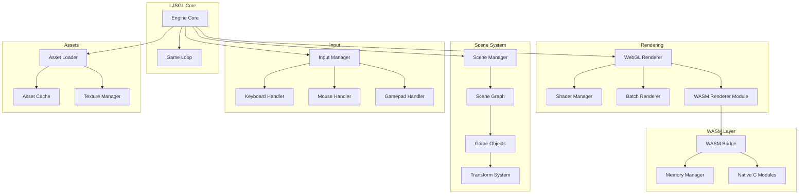

# LJSGL.js Design Document

## Overview

LJSGL.js is a lightweight, high-performance JavaScript game engine that abstracts WebGL rendering while providing optional low-level memory control through WebAssembly/Emscripten. The architecture follows a modular design where each subsystem (renderer, scene, input, assets) operates independently but integrates seamlessly through a central engine core.

The library is built with pure JavaScript, compiled via Webpack with Terser for minimal bundle size. By default, all math calculations and performance-critical rendering operations run through WebAssembly modules for maximum performance. A pure JS fallback exists only for browsers without WASM support.

## Architecture



## Components and Interfaces

### Engine Core

The central orchestrator that initializes all subsystems and manages the game lifecycle.

```typescript
interface LJSGLConfig {
  canvas: HTMLCanvasElement | string;
  width?: number;
  height?: number;
  webglVersion?: 1 | 2;
  antialias?: boolean;
  alpha?: boolean;
  disableWASM?: boolean;  // WASM enabled by default, set true to force JS fallback
  wasmPath?: string;      // Custom path to WASM modules (default: bundled)
  fixedTimestep?: number;
}

interface LJSGLEngine {
  // Core
  readonly gl: WebGLRenderingContext | WebGL2RenderingContext;
  readonly canvas: HTMLCanvasElement;
  readonly renderer: Renderer;
  readonly scene: SceneManager;
  readonly input: InputManager;
  readonly assets: AssetLoader;
  readonly wasm: WASMBridge | null;
  
  // Lifecycle
  start(): void;
  stop(): void;
  pause(): void;
  resume(): void;
  
  // Callbacks
  onUpdate: (deltaTime: number) => void;
  onFixedUpdate: (fixedDelta: number) => void;
  onRender: (renderer: Renderer) => void;
  
  // Metrics
  getFPS(): number;
  getFrameTime(): number;
}
```

### WebGL Renderer

Abstracts WebGL operations while exposing the raw context for advanced use.

```typescript
interface Renderer {
  readonly gl: WebGLRenderingContext | WebGL2RenderingContext;
  
  // Setup
  setClearColor(r: number, g: number, b: number, a?: number): void;
  setViewport(x: number, y: number, width: number, height: number): void;
  
  // Rendering
  clear(): void;
  render(scene: Scene): void;
  renderMesh(mesh: Mesh, material: Material, transform: Matrix4): void;
  
  // Batching
  beginBatch(): void;
  endBatch(): void;
  
  // Shaders
  createShader(vertexSrc: string, fragmentSrc: string): ShaderProgram;
  useShader(shader: ShaderProgram): void;
  
  // Textures
  createTexture(image: ImageData | HTMLImageElement): WebGLTexture;
  bindTexture(texture: WebGLTexture, unit?: number): void;
  
  // Direct access for advanced users
  getContext(): WebGLRenderingContext | WebGL2RenderingContext;
}

interface Mesh {
  readonly vertexBuffer: WebGLBuffer;
  readonly indexBuffer: WebGLBuffer | null;
  readonly vertexCount: number;
  readonly indexCount: number;
  
  setVertices(data: Float32Array): void;
  setIndices(data: Uint16Array | Uint32Array): void;
  setAttribute(name: string, size: number, offset: number, stride: number): void;
  dispose(): void;
}

interface ShaderProgram {
  readonly program: WebGLProgram;
  
  use(): void;
  setUniform(name: string, value: number | number[] | Matrix4 | Vector3): void;
  getUniformLocation(name: string): WebGLUniformLocation | null;
  getAttribLocation(name: string): number;
  dispose(): void;
}

interface Material {
  shader: ShaderProgram;
  textures: Map<string, WebGLTexture>;
  uniforms: Map<string, any>;
  
  setTexture(name: string, texture: WebGLTexture): void;
  setUniform(name: string, value: any): void;
  bind(): void;
}
```

### Scene Management

Hierarchical scene graph with transform propagation.

```typescript
interface SceneManager {
  readonly activeScene: Scene | null;
  
  createScene(name: string): Scene;
  loadScene(name: string): Promise<Scene>;
  switchScene(name: string): void;
  getScene(name: string): Scene | null;
  disposeScene(name: string): void;
}

interface Scene {
  readonly name: string;
  readonly root: GameObject;
  
  // Object management
  createObject(name?: string): GameObject;
  addObject(obj: GameObject): void;
  removeObject(obj: GameObject): void;
  findByName(name: string): GameObject | null;
  findByTag(tag: string): GameObject[];
  findByLayer(layer: number): GameObject[];
  query(predicate: (obj: GameObject) => boolean): GameObject[];
  
  // Lifecycle
  update(deltaTime: number): void;
  render(renderer: Renderer): void;
  dispose(): void;
}

interface GameObject {
  name: string;
  tag: string;
  layer: number;
  active: boolean;
  
  readonly transform: Transform;
  readonly parent: GameObject | null;
  readonly children: readonly GameObject[];
  
  // Hierarchy
  addChild(child: GameObject): void;
  removeChild(child: GameObject): void;
  setParent(parent: GameObject | null): void;
  
  // Components
  addComponent<T extends Component>(component: T): T;
  getComponent<T extends Component>(type: new () => T): T | null;
  removeComponent<T extends Component>(type: new () => T): void;
  
  // Lifecycle
  update(deltaTime: number): void;
  dispose(): void;
}

interface Transform {
  position: Vector3;
  rotation: Quaternion;
  scale: Vector3;
  
  readonly localMatrix: Matrix4;
  readonly worldMatrix: Matrix4;
  
  translate(x: number, y: number, z: number): void;
  rotate(axis: Vector3, angle: number): void;
  lookAt(target: Vector3): void;
  
  updateMatrix(): void;
  updateWorldMatrix(parentMatrix?: Matrix4): void;
}

interface Component {
  readonly gameObject: GameObject;
  enabled: boolean;
  
  onAttach?(): void;
  onDetach?(): void;
  onUpdate?(deltaTime: number): void;
  onRender?(renderer: Renderer): void;
}
```

### WASM Bridge

Interface for WebAssembly/Emscripten integration with memory management.

```typescript
interface WASMBridge {
  readonly module: WebAssembly.Module | null;
  readonly instance: WebAssembly.Instance | null;
  readonly memory: WebAssembly.Memory | null;
  readonly ready: boolean;
  
  // Initialization
  load(wasmPath: string): Promise<void>;
  
  // Memory management
  alloc(bytes: number): number;
  free(ptr: number): void;
  getMemoryView(): ArrayBuffer;
  getFloat32View(ptr: number, length: number): Float32Array;
  getInt32View(ptr: number, length: number): Int32Array;
  getUint8View(ptr: number, length: number): Uint8Array;
  
  // Function calls
  call<T>(funcName: string, ...args: number[]): T;
  getExport<T>(name: string): T;
  
  // Data transfer
  copyToWASM(data: ArrayBufferView, destPtr: number): void;
  copyFromWASM(srcPtr: number, length: number): ArrayBuffer;
  
  // Rendering integration
  createWASMBuffer(size: number): WASMBuffer;
  bindWASMBufferToGL(buffer: WASMBuffer, target: number): void;
}

interface WASMBuffer {
  readonly ptr: number;
  readonly size: number;
  readonly glBuffer: WebGLBuffer | null;
  
  update(data: ArrayBufferView): void;
  dispose(): void;
}

interface MemoryManager {
  readonly totalMemory: number;
  readonly usedMemory: number;
  readonly freeMemory: number;
  
  allocate(size: number, alignment?: number): number;
  deallocate(ptr: number): void;
  resize(ptr: number, newSize: number): number;
  
  // Pool allocators for frequent allocations
  createPool(objectSize: number, count: number): MemoryPool;
}

interface MemoryPool {
  alloc(): number;
  free(ptr: number): void;
  reset(): void;
  dispose(): void;
}
```

### Input Manager

Unified input handling across devices.

```typescript
interface InputManager {
  readonly keyboard: KeyboardHandler;
  readonly mouse: MouseHandler;
  readonly gamepad: GamepadHandler;
  
  // Action mapping
  defineAction(name: string, bindings: InputBinding[]): void;
  isActionPressed(name: string): boolean;
  isActionJustPressed(name: string): boolean;
  isActionJustReleased(name: string): boolean;
  getActionValue(name: string): number;
  
  // Events
  on(event: InputEvent, callback: InputCallback): void;
  off(event: InputEvent, callback: InputCallback): void;
  
  // Update (called internally)
  update(): void;
}

interface KeyboardHandler {
  isKeyDown(key: string): boolean;
  isKeyPressed(key: string): boolean;
  isKeyReleased(key: string): boolean;
  getKeysDown(): string[];
}

interface MouseHandler {
  readonly x: number;
  readonly y: number;
  readonly normalizedX: number;  // -1 to 1
  readonly normalizedY: number;  // -1 to 1
  readonly deltaX: number;
  readonly deltaY: number;
  
  isButtonDown(button: number): boolean;
  isButtonPressed(button: number): boolean;
  isButtonReleased(button: number): boolean;
  
  lockPointer(): void;
  unlockPointer(): void;
  readonly isPointerLocked: boolean;
}

interface GamepadHandler {
  readonly connected: boolean;
  readonly gamepads: Gamepad[];
  
  getAxis(gamepadIndex: number, axisIndex: number): number;
  isButtonDown(gamepadIndex: number, buttonIndex: number): boolean;
  getButtonValue(gamepadIndex: number, buttonIndex: number): number;
}

type InputBinding = 
  | { type: 'key'; key: string }
  | { type: 'mouseButton'; button: number }
  | { type: 'gamepadButton'; button: number }
  | { type: 'gamepadAxis'; axis: number; threshold?: number };
```

### Asset Loader

Async asset loading with caching and progress tracking.

```typescript
interface AssetLoader {
  readonly cache: AssetCache;
  
  // Loading
  loadTexture(url: string): Promise<WebGLTexture>;
  loadShader(vertUrl: string, fragUrl: string): Promise<ShaderProgram>;
  loadJSON<T>(url: string): Promise<T>;
  loadBinary(url: string): Promise<ArrayBuffer>;
  loadWASM(url: string): Promise<WebAssembly.Module>;
  
  // Batch loading
  loadAll(manifest: AssetManifest): Promise<void>;
  onProgress: (loaded: number, total: number, currentAsset: string) => void;
  
  // Management
  preload(urls: string[]): Promise<void>;
  unload(url: string): void;
  clearCache(): void;
}

interface AssetCache {
  get<T>(key: string): T | null;
  set<T>(key: string, value: T): void;
  has(key: string): boolean;
  delete(key: string): void;
  clear(): void;
}

interface AssetManifest {
  textures?: string[];
  shaders?: Array<{ name: string; vertex: string; fragment: string }>;
  json?: string[];
  binary?: string[];
  wasm?: string[];
}
```

## Data Models

### Math Types

```typescript
interface Vector2 {
  x: number;
  y: number;
  
  set(x: number, y: number): this;
  add(v: Vector2): this;
  sub(v: Vector2): this;
  scale(s: number): this;
  dot(v: Vector2): number;
  length(): number;
  normalize(): this;
  clone(): Vector2;
  toArray(): [number, number];
}

interface Vector3 {
  x: number;
  y: number;
  z: number;
  
  set(x: number, y: number, z: number): this;
  add(v: Vector3): this;
  sub(v: Vector3): this;
  scale(s: number): this;
  dot(v: Vector3): number;
  cross(v: Vector3): this;
  length(): number;
  normalize(): this;
  clone(): Vector3;
  toArray(): [number, number, number];
}

interface Matrix4 {
  elements: Float32Array;  // 16 elements, column-major
  
  identity(): this;
  multiply(m: Matrix4): this;
  translate(x: number, y: number, z: number): this;
  rotateX(angle: number): this;
  rotateY(angle: number): this;
  rotateZ(angle: number): this;
  scale(x: number, y: number, z: number): this;
  
  perspective(fov: number, aspect: number, near: number, far: number): this;
  orthographic(left: number, right: number, bottom: number, top: number, near: number, far: number): this;
  lookAt(eye: Vector3, target: Vector3, up: Vector3): this;
  
  invert(): this;
  transpose(): this;
  clone(): Matrix4;
}

interface Quaternion {
  x: number;
  y: number;
  z: number;
  w: number;
  
  identity(): this;
  setFromAxisAngle(axis: Vector3, angle: number): this;
  setFromEuler(x: number, y: number, z: number): this;
  multiply(q: Quaternion): this;
  normalize(): this;
  toMatrix4(): Matrix4;
  clone(): Quaternion;
}
```

### Color

```typescript
interface Color {
  r: number;  // 0-1
  g: number;  // 0-1
  b: number;  // 0-1
  a: number;  // 0-1
  
  setRGB(r: number, g: number, b: number): this;
  setRGBA(r: number, g: number, b: number, a: number): this;
  setHex(hex: number): this;
  toArray(): [number, number, number, number];
  toHex(): number;
}
```

## Error Handling

The library uses a consistent error handling strategy:

```typescript
// Custom error types
class LJSGLError extends Error {
  constructor(message: string, public code: string) {
    super(`[LJSGL] ${message}`);
    this.name = 'LJSGLError';
  }
}

class WebGLError extends LJSGLError {
  constructor(message: string, public glError?: number) {
    super(message, 'WEBGL_ERROR');
  }
}

class ShaderError extends LJSGLError {
  constructor(message: string, public shaderLog?: string) {
    super(message, 'SHADER_ERROR');
  }
}

class WASMError extends LJSGLError {
  constructor(message: string) {
    super(message, 'WASM_ERROR');
  }
}

class AssetError extends LJSGLError {
  constructor(message: string, public url?: string) {
    super(message, 'ASSET_ERROR');
  }
}

// Error codes
enum ErrorCode {
  WEBGL_NOT_SUPPORTED = 'WEBGL_NOT_SUPPORTED',
  WEBGL_CONTEXT_LOST = 'WEBGL_CONTEXT_LOST',
  SHADER_COMPILE_FAILED = 'SHADER_COMPILE_FAILED',
  SHADER_LINK_FAILED = 'SHADER_LINK_FAILED',
  WASM_NOT_SUPPORTED = 'WASM_NOT_SUPPORTED',
  WASM_LOAD_FAILED = 'WASM_LOAD_FAILED',
  WASM_MEMORY_ERROR = 'WASM_MEMORY_ERROR',
  ASSET_LOAD_FAILED = 'ASSET_LOAD_FAILED',
  ASSET_NOT_FOUND = 'ASSET_NOT_FOUND',
}
```

## Testing Strategy

### Unit Tests

- Math utilities (Vector2, Vector3, Matrix4, Quaternion)
- Asset cache operations
- Input state management
- Scene graph operations (add/remove/query)
- Transform hierarchy calculations
- WASM memory management utilities

### Integration Tests

- Engine initialization with various configurations
- WebGL context creation and state management
- Shader compilation and uniform setting
- Texture loading and binding
- Scene rendering pipeline
- WASM module loading and function calls
- Input event handling

### Performance Tests

- Batch rendering throughput (draw calls per frame)
- Scene graph update performance with deep hierarchies
- Memory allocation/deallocation patterns
- WASM vs JS performance comparisons for math operations

### Browser Compatibility Tests

- WebGL 1 and WebGL 2 contexts
- WASM support detection and fallback
- Input API availability (Gamepad API, Pointer Lock)
- Various canvas configurations

### Test Tools

- Jest for unit and integration tests
- Puppeteer for browser-based rendering tests
- Custom benchmarking harness for performance tests
