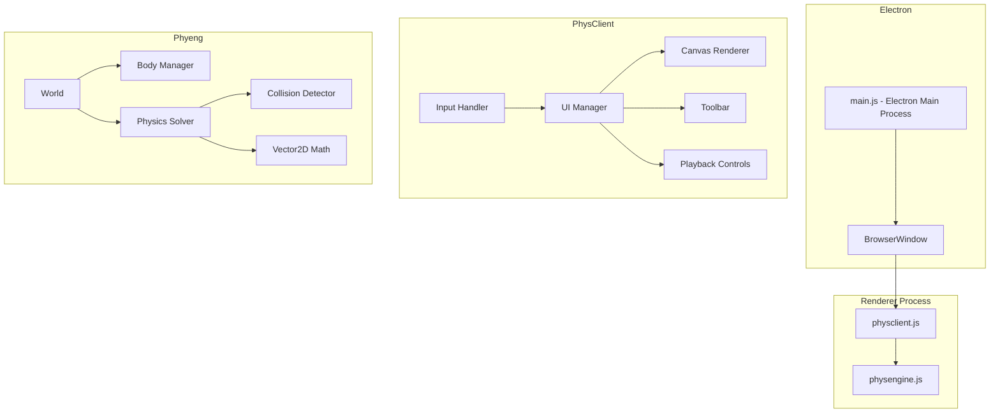

# Design Document

## Overview

Phys is a desktop physics simulation application built with Electron and pure JavaScript. The app features a custom-built physics engine called Phyeng that handles 2D rigid body dynamics including gravity, collision detection/response, and friction. The application is compiled using Webpack with Terser for minification, producing two output bundles: `physengine.js` (the engine) and `physclient.js` (the UI/app layer). The app runs on port 7300 and is packaged with electron-builder.

## Architecture



## Project Structure

```
phys/
├── package.json
├── webpack.config.js
├── electron-builder.yml
├── src/
│   ├── main.js                    # Electron main process
│   ├── preload.js                 # Electron preload script
│   ├── engine/                    # Phyeng - Physics Engine
│   │   ├── index.js               # Engine entry point (exports Phyeng)
│   │   ├── World.js               # Simulation world container
│   │   ├── Body.js                # Physics body base class
│   │   ├── shapes/
│   │   │   ├── Rectangle.js       # Rectangle body
│   │   │   └── Circle.js          # Circle body
│   │   ├── physics/
│   │   │   ├── Solver.js          # Physics solver (integration)
│   │   │   ├── Collision.js       # Collision detection
│   │   │   └── Response.js        # Collision response
│   │   └── math/
│   │       └── Vector2.js         # 2D vector math utilities
│   ├── client/                    # PhysClient - Application
│   │   ├── index.js               # Client entry point
│   │   ├── App.js                 # Main application controller
│   │   ├── Renderer.js            # Canvas rendering
│   │   ├── InputHandler.js        # Mouse/keyboard input
│   │   ├── ui/
│   │   │   ├── Toolbar.js         # Object selection toolbar
│   │   │   ├── Controls.js        # Play/pause/reset controls
│   │   │   └── ObjectPanel.js     # Object properties panel
│   │   └── icons/
│   │       └── icons.js           # SVG icon definitions
│   └── renderer/
│       ├── index.html             # Main HTML file
│       └── styles.css             # Application styles
├── dist/                          # Webpack output
│   ├── physengine.js
│   └── physclient.js
└── build/                         # electron-builder output
```

## Components and Interfaces

### Phyeng (Physics Engine)

#### Vector2
```javascript
class Vector2 {
  constructor(x = 0, y = 0)
  add(v)           // Returns new Vector2
  subtract(v)      // Returns new Vector2
  multiply(scalar) // Returns new Vector2
  dot(v)           // Returns number
  magnitude()      // Returns number
  normalize()      // Returns new Vector2
  clone()          // Returns new Vector2
}
```

#### Body
```javascript
class Body {
  constructor(options = {})
  // Properties
  id: string
  position: Vector2
  velocity: Vector2
  acceleration: Vector2
  mass: number
  restitution: number      // Bounciness (0-1)
  friction: number         // Surface friction (0-1)
  isStatic: boolean        // Immovable object
  angle: number            // Rotation in radians
  angularVelocity: number
  
  // Methods
  applyForce(force: Vector2)
  update(dt: number)
  getBounds()              // Returns AABB
}
```

#### Rectangle (extends Body)
```javascript
class Rectangle extends Body {
  constructor(x, y, width, height, options = {})
  width: number
  height: number
  getVertices()    // Returns Vector2[]
}
```

#### Circle (extends Body)
```javascript
class Circle extends Body {
  constructor(x, y, radius, options = {})
  radius: number
}
```

#### World
```javascript
class World {
  constructor(options = {})
  gravity: Vector2
  bodies: Body[]
  
  addBody(body: Body)
  removeBody(body: Body)
  clear()
  step(dt: number)         // Advance simulation
  getBodyAt(position: Vector2)  // Hit testing
}
```

#### Collision
```javascript
class Collision {
  static detectAABB(a: Body, b: Body)           // Broad phase
  static detectCircleCircle(a: Circle, b: Circle)
  static detectRectRect(a: Rectangle, b: Rectangle)
  static detectCircleRect(circle: Circle, rect: Rectangle)
}
```

#### Solver
```javascript
class Solver {
  constructor(world: World)
  integrate(body: Body, dt: number)    // Velocity Verlet integration
  resolveCollision(bodyA: Body, bodyB: Body, collision: CollisionInfo)
  applyFriction(body: Body, dt: number)
}
```

### PhysClient (Application)

#### App
```javascript
class App {
  constructor(container: HTMLElement)
  engine: World
  renderer: Renderer
  inputHandler: InputHandler
  isPlaying: boolean
  
  init()
  play()
  pause()
  reset()
  update(dt: number)
}
```

#### Renderer
```javascript
class Renderer {
  constructor(canvas: HTMLCanvasElement)
  ctx: CanvasRenderingContext2D
  
  clear()
  render(world: World)
  drawBody(body: Body)
  drawSelection(body: Body)
  resize(width: number, height: number)
}
```

#### InputHandler
```javascript
class InputHandler {
  constructor(canvas: HTMLCanvasElement, app: App)
  selectedTool: string     // 'select' | 'rectangle' | 'circle'
  selectedBody: Body | null
  isDragging: boolean
  
  onMouseDown(e: MouseEvent)
  onMouseMove(e: MouseEvent)
  onMouseUp(e: MouseEvent)
  screenToWorld(x: number, y: number): Vector2
}
```

#### Toolbar
```javascript
class Toolbar {
  constructor(container: HTMLElement, onToolSelect: Function)
  currentTool: string
  
  render()
  setTool(tool: string)
}
```

#### Controls
```javascript
class Controls {
  constructor(container: HTMLElement, callbacks: {onPlay, onPause, onReset})
  
  render()
  setPlayState(isPlaying: boolean)
}
```

## Data Models

### Body Configuration
```javascript
{
  id: string,              // Unique identifier (UUID)
  type: 'rectangle' | 'circle',
  position: { x: number, y: number },
  velocity: { x: number, y: number },
  mass: number,            // Default: 1
  restitution: number,     // Default: 0.5
  friction: number,        // Default: 0.3
  isStatic: boolean,       // Default: false
  angle: number,           // Default: 0
  // Shape-specific
  width?: number,          // Rectangle only
  height?: number,         // Rectangle only
  radius?: number          // Circle only
}
```

### World State (for reset functionality)
```javascript
{
  gravity: { x: number, y: number },
  bodies: BodyConfiguration[]
}
```

### Collision Info
```javascript
{
  bodyA: Body,
  bodyB: Body,
  normal: Vector2,         // Collision normal
  depth: number,           // Penetration depth
  contactPoint: Vector2
}
```

## Error Handling

| Scenario | Handling |
|----------|----------|
| Invalid body parameters | Throw descriptive error with parameter name |
| Canvas context unavailable | Display error message, disable simulation |
| Body placement outside bounds | Clamp position to canvas boundaries |
| Division by zero (mass = 0) | Treat as static body (infinite mass) |
| Collision detection edge cases | Use epsilon comparisons for floating point |

## Testing Strategy

Tests are run using `phystest`, a custom lightweight test runner built specifically for Phys. Located at `src/test/phystest.js`.

### phystest Runner
```javascript
// Simple test runner API
phystest.describe(name, fn)    // Group tests
phystest.test(name, fn)        // Define a test
phystest.expect(value)         // Assertion chain
  .toBe(expected)              // Strict equality
  .toEqual(expected)           // Deep equality
  .toBeCloseTo(expected, precision)  // Float comparison
  .toBeTruthy()
  .toBeFalsy()
  .toThrow()

// Run with: node src/test/run.js
```

### Unit Tests
- Vector2 math operations (add, subtract, dot, normalize)
- Body physics calculations (force application, velocity integration)
- Collision detection algorithms (AABB, circle-circle, rect-rect, circle-rect)
- Collision response calculations

### Integration Tests
- World simulation step with multiple bodies
- Object placement and removal
- State save/restore for reset functionality

### Manual Testing
- Visual verification of physics behavior
- UI interaction (toolbar, controls)
- Window resize handling
- Electron packaging and distribution

## Build Configuration

### Webpack Config Highlights
```javascript
// webpack.config.js structure
module.exports = [
  {
    name: 'engine',
    entry: './src/engine/index.js',
    output: {
      filename: 'physengine.js',
      library: 'Phyeng',
      libraryTarget: 'umd'
    },
    optimization: {
      minimizer: [new TerserPlugin()]
    }
  },
  {
    name: 'client',
    entry: './src/client/index.js',
    output: {
      filename: 'physclient.js'
    },
    optimization: {
      minimizer: [new TerserPlugin()]
    }
  }
]
```

### Electron Builder Config
```yaml
# electron-builder.yml
appId: com.phys.app
productName: Phys
directories:
  output: build
files:
  - dist/**/*
  - src/renderer/**/*
  - src/main.js
  - src/preload.js
mac:
  target: dmg
win:
  target: nsis
linux:
  target: AppImage
```

## SVG Icons

All UI icons are custom inline SVGs stored in `src/client/icons/icons.js`:

- `playIcon` - Triangle play symbol
- `pauseIcon` - Double bar pause symbol  
- `resetIcon` - Circular arrow reset symbol
- `selectIcon` - Cursor/pointer for selection tool
- `rectangleIcon` - Square outline for rectangle tool
- `circleIcon` - Circle outline for circle tool
- `deleteIcon` - Trash can for object deletion
