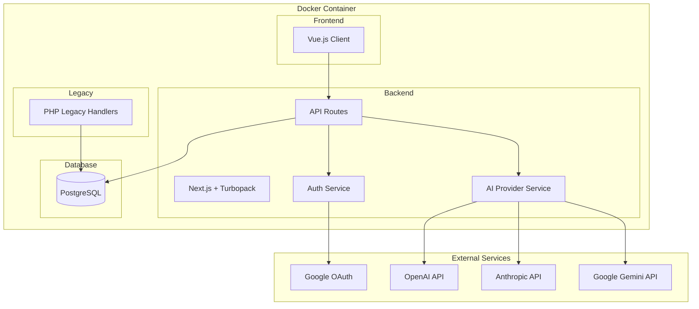

# Udan Platform - Design Document

## Overview

Udan is a self-hosted AI agent deployment platform that enables users to interact with AI models from multiple providers (OpenAI, Anthropic, Google Gemini). The platform runs in a Docker container, uses PostgreSQL for persistence, and features a modern Vue.js frontend with a Next.js/Turbopack backend.

### Key Design Principles

- **Self-contained deployment**: Single Docker container with Python3 setup script
- **Provider-agnostic**: Extensible architecture for multiple AI providers
- **Privacy-first**: Encrypted API keys, admin cannot view user keys
- **Role-based access**: Admin vs User with distinct capabilities
- **Modern UX**: Clean, Next.js-style interface with JetBrains Mono font

---

## Architecture

### High-Level Architecture



### Directory Structure

```
udan/
├── docker/
│   ├── Dockerfile
│   └── docker-compose.yml
├── setup.py                    # Python3 setup script
├── client/                     # Vue.js frontend
│   ├── src/
│   │   ├── components/
│   │   │   ├── auth/
│   │   │   │   └── GoogleLogin.vue
│   │   │   ├── chat/
│   │   │   │   ├── ChatWindow.vue
│   │   │   │   ├── MessageList.vue
│   │   │   │   └── MessageInput.vue
│   │   │   ├── dashboard/
│   │   │   │   ├── UserDashboard.vue
│   │   │   │   ├── AdminDashboard.vue
│   │   │   │   └── ConversationSidebar.vue
│   │   │   ├── admin/
│   │   │   │   ├── ModelManager.vue
│   │   │   │   ├── UserKeyOverview.vue
│   │   │   │   └── GlobalKeySettings.vue
│   │   │   └── settings/
│   │   │       ├── UserSettings.vue
│   │   │       └── ApiKeySettings.vue
│   │   ├── views/
│   │   │   ├── LoginView.vue
│   │   │   ├── AdminRegisterView.vue
│   │   │   ├── DashboardView.vue
│   │   │   └── ChatView.vue
│   │   ├── stores/
│   │   │   ├── auth.ts
│   │   │   ├── conversations.ts
│   │   │   └── models.ts
│   │   ├── router/
│   │   │   └── index.ts
│   │   ├── styles/
│   │   │   └── main.css
│   │   ├── App.vue
│   │   └── main.ts
│   ├── package.json
│   └── vite.config.ts
├── server/                     # Next.js backend
│   ├── src/
│   │   ├── app/
│   │   │   ├── api/
│   │   │   │   ├── auth/
│   │   │   │   │   ├── google/route.ts
│   │   │   │   │   └── session/route.ts
│   │   │   │   ├── users/
│   │   │   │   │   └── route.ts
│   │   │   │   ├── models/
│   │   │   │   │   └── route.ts
│   │   │   │   ├── conversations/
│   │   │   │   │   └── route.ts
│   │   │   │   ├── messages/
│   │   │   │   │   └── route.ts
│   │   │   │   ├── chat/
│   │   │   │   │   └── route.ts
│   │   │   │   └── keys/
│   │   │   │       ├── global/route.ts
│   │   │   │       └── user/route.ts
│   │   │   └── layout.tsx
│   │   ├── services/
│   │   │   ├── auth.service.ts
│   │   │   ├── ai.service.ts
│   │   │   ├── encryption.service.ts
│   │   │   └── database.service.ts
│   │   ├── providers/
│   │   │   ├── base.provider.ts
│   │   │   ├── openai.provider.ts
│   │   │   ├── anthropic.provider.ts
│   │   │   └── gemini.provider.ts
│   │   ├── models/
│   │   │   ├── user.model.ts
│   │   │   ├── conversation.model.ts
│   │   │   ├── message.model.ts
│   │   │   └── ai-model.model.ts
│   │   └── middleware/
│   │       ├── auth.middleware.ts
│   │       └── admin.middleware.ts
│   ├── package.json
│   ├── next.config.js
│   └── tsconfig.json
├── legacy/                     # PHP legacy components
│   └── api/
│       └── legacy-handler.php
├── database/
│   └── migrations/
│       └── 001_initial_schema.sql
└── README.md
```

---

## Components and Interfaces

### Frontend Components (Vue.js)

#### Authentication Components

| Component | Purpose | Props/Events |
|-----------|---------|--------------|
| `GoogleLogin.vue` | Google OAuth sign-in button | `@success`, `@error` |
| `AdminRegisterView.vue` | First-user admin registration form | `@registered` |

#### Dashboard Components

| Component | Purpose | Props/Events |
|-----------|---------|--------------|
| `UserDashboard.vue` | Regular user main dashboard | `user`, `conversations` |
| `AdminDashboard.vue` | Admin main dashboard with model management | `user`, `models`, `userKeys` |
| `ConversationSidebar.vue` | List of user conversations | `conversations`, `@select` |

#### Chat Components

| Component | Purpose | Props/Events |
|-----------|---------|--------------|
| `ChatWindow.vue` | Main chat interface container | `conversation`, `model` |
| `MessageList.vue` | Displays conversation messages | `messages` |
| `MessageInput.vue` | Text input for sending messages | `@send`, `disabled` |

#### Admin Components

| Component | Purpose | Props/Events |
|-----------|---------|--------------|
| `ModelManager.vue` | CRUD interface for AI models | `models`, `@create`, `@update`, `@delete` |
| `UserKeyOverview.vue` | View users with custom keys, revoke access | `users`, `@revoke` |
| `GlobalKeySettings.vue` | Configure global API keys | `keys`, `@save` |

#### Settings Components

| Component | Purpose | Props/Events |
|-----------|---------|--------------|
| `UserSettings.vue` | User profile and preferences | `user`, `@save` |
| `ApiKeySettings.vue` | User custom API key management | `keys`, `@save`, `@delete` |

### Backend API Routes (Next.js)

#### Authentication Routes

| Endpoint | Method | Description |
|----------|--------|-------------|
| `/api/auth/google` | POST | Handle Google OAuth callback |
| `/api/auth/session` | GET | Get current session |
| `/api/auth/session` | DELETE | Logout / destroy session |

#### User Routes

| Endpoint | Method | Description |
|----------|--------|-------------|
| `/api/users` | GET | List users (admin only) |
| `/api/users/:id` | GET | Get user details |
| `/api/users/:id` | PATCH | Update user |

#### AI Model Routes

| Endpoint | Method | Description |
|----------|--------|-------------|
| `/api/models` | GET | List available AI models |
| `/api/models` | POST | Create new AI model (admin) |
| `/api/models/:id` | GET | Get model details |
| `/api/models/:id` | PATCH | Update model (admin) |
| `/api/models/:id` | DELETE | Delete model (admin) |

#### Conversation Routes

| Endpoint | Method | Description |
|----------|--------|-------------|
| `/api/conversations` | GET | List user's conversations |
| `/api/conversations` | POST | Create new conversation |
| `/api/conversations/:id` | GET | Get conversation with messages |
| `/api/conversations/:id` | DELETE | Delete conversation |

#### Chat Routes

| Endpoint | Method | Description |
|----------|--------|-------------|
| `/api/chat` | POST | Send message to AI, get response |

#### API Key Routes

| Endpoint | Method | Description |
|----------|--------|-------------|
| `/api/keys/global` | GET | Get global keys (masked, admin) |
| `/api/keys/global` | POST | Set global API key (admin) |
| `/api/keys/user` | GET | Get user's custom keys (masked) |
| `/api/keys/user` | POST | Set user custom API key |
| `/api/keys/user` | DELETE | Remove user custom API key |
| `/api/keys/user/overview` | GET | List users with custom keys (admin) |
| `/api/keys/user/:userId/revoke` | POST | Revoke user's custom keys (admin) |

### Service Layer

#### AuthService

```typescript
interface AuthService {
  verifyGoogleToken(token: string): Promise<GoogleUser>;
  createSession(user: User): Promise<Session>;
  getSession(sessionId: string): Promise<Session | null>;
  destroySession(sessionId: string): Promise<void>;
  isFirstUser(): Promise<boolean>;
}
```

#### AIService

```typescript
interface AIService {
  chat(modelId: string, messages: Message[], userId: string): Promise<AIResponse>;
  getProvider(providerName: string): AIProvider;
  resolveApiKey(userId: string, provider: string): Promise<string>;
}
```

#### EncryptionService

```typescript
interface EncryptionService {
  encrypt(plaintext: string): string;
  decrypt(ciphertext: string): string;
  mask(value: string): string; // Returns "sk-...xxxx"
}
```

### AI Provider Interface

```typescript
interface AIProvider {
  name: string;
  models: string[];
  chat(apiKey: string, model: string, messages: Message[]): Promise<AIResponse>;
  validateApiKey(apiKey: string): Promise<boolean>;
}
```

---

## Data Models

### Entity Relationship Diagram

```mermaid
erDiagram
    USER ||--o{ CONVERSATION : has
    USER ||--o{ USER_API_KEY : has
    CONVERSATION ||--o{ MESSAGE : contains
    AI_MODEL ||--o{ CONVERSATION : used_in
    GLOBAL_API_KEY ||--|| AI_PROVIDER : for

    USER {
        uuid id PK
        string email
        string name
        string avatar_url
        enum role "admin|user"
        timestamp created_at
        timestamp updated_at
    }

    AI_MODEL {
        uuid id PK
        string name
        string provider "openai|anthropic|gemini"
        string model_id
        text system_prompt
        boolean is_active
        timestamp created_at
        timestamp updated_at
    }

    CONVERSATION {
        uuid id PK
        uuid user_id FK
        uuid model_id FK
        string title
        timestamp created_at
        timestamp updated_at
    }

    MESSAGE {
        uuid id PK
        uuid conversation_id FK
        enum role "user|assistant|system"
        text content
        timestamp created_at
    }

    GLOBAL_API_KEY {
        uuid id PK
        string provider "openai|anthropic|gemini"
        text encrypted_key
        timestamp created_at
        timestamp updated_at
    }

    USER_API_KEY {
        uuid id PK
        uuid user_id FK
        string provider "openai|anthropic|gemini"
        text encrypted_key
        timestamp created_at
        timestamp updated_at
    }
}
```

### TypeScript Models

```typescript
// User Model
interface User {
  id: string;
  email: string;
  name: string;
  avatarUrl?: string;
  role: 'admin' | 'user';
  createdAt: Date;
  updatedAt: Date;
}

// AI Model Configuration
interface AIModel {
  id: string;
  name: string;
  provider: 'openai' | 'anthropic' | 'gemini';
  modelId: string;
  systemPrompt: string;
  isActive: boolean;
  createdAt: Date;
  updatedAt: Date;
}

// Conversation
interface Conversation {
  id: string;
  userId: string;
  modelId: string;
  title: string;
  createdAt: Date;
  updatedAt: Date;
  messages?: Message[];
}

// Message
interface Message {
  id: string;
  conversationId: string;
  role: 'user' | 'assistant' | 'system';
  content: string;
  createdAt: Date;
}

// API Key (for display - masked)
interface ApiKeyDisplay {
  id: string;
  provider: string;
  maskedKey: string; // "sk-...xxxx"
  createdAt: Date;
}

// User with custom keys (admin view)
interface UserKeyOverview {
  userId: string;
  userName: string;
  userEmail: string;
  providers: string[]; // Which providers they have keys for
}
```

---

## Error Handling

### Error Response Format

```typescript
interface ErrorResponse {
  error: {
    code: string;
    message: string;
    details?: Record<string, any>;
  };
}
```

### Error Codes

| Code | HTTP Status | Description |
|------|-------------|-------------|
| `AUTH_REQUIRED` | 401 | User not authenticated |
| `AUTH_INVALID_TOKEN` | 401 | Invalid or expired token |
| `FORBIDDEN` | 403 | User lacks permission |
| `NOT_FOUND` | 404 | Resource not found |
| `VALIDATION_ERROR` | 400 | Invalid request data |
| `AI_PROVIDER_ERROR` | 502 | AI provider API error |
| `AI_KEY_MISSING` | 400 | No API key configured for provider |
| `AI_KEY_INVALID` | 401 | API key rejected by provider |
| `RATE_LIMITED` | 429 | Too many requests |
| `INTERNAL_ERROR` | 500 | Unexpected server error |

### Error Handling Strategy

1. **API Key Resolution**: If user has custom key, use it. Otherwise, fall back to global key. If neither exists, return `AI_KEY_MISSING`.
2. **Provider Errors**: Catch provider-specific errors and normalize to `AI_PROVIDER_ERROR` with details.
3. **Auth Errors**: Redirect to login on 401, show permission denied on 403.
4. **Validation**: Return field-specific errors for form validation.

---

## Testing Strategy (Jest - Mandatory)

All tests MUST use Jest as the testing framework. Tests are required, not optional.

### Test Directory Structure

```
client/
├── src/
│   └── components/
│       └── __tests__/           # Component tests
├── jest.config.js
└── package.json

server/
├── src/
│   ├── services/
│   │   └── __tests__/           # Service unit tests
│   ├── providers/
│   │   └── __tests__/           # Provider unit tests
│   └── app/
│       └── api/
│           └── __tests__/       # API integration tests
├── jest.config.js
└── package.json
```

### Jest Configuration

```javascript
// server/jest.config.js
module.exports = {
  preset: 'ts-jest',
  testEnvironment: 'node',
  roots: ['<rootDir>/src'],
  testMatch: ['**/__tests__/**/*.test.ts'],
  collectCoverageFrom: ['src/**/*.ts', '!src/**/*.d.ts'],
  setupFilesAfterEnv: ['<rootDir>/src/test/setup.ts'],
};

// client/jest.config.js
module.exports = {
  preset: 'ts-jest',
  testEnvironment: 'jsdom',
  roots: ['<rootDir>/src'],
  testMatch: ['**/__tests__/**/*.test.ts'],
  moduleFileExtensions: ['ts', 'js', 'vue'],
  transform: {
    '^.+\\.vue$': '@vue/vue3-jest',
    '^.+\\.ts$': 'ts-jest',
  },
  collectCoverageFrom: ['src/**/*.{ts,vue}', '!src/**/*.d.ts'],
};
```

### Unit Tests (Required)

| Component | Test Focus | Test File |
|-----------|------------|-----------|
| `EncryptionService` | Encrypt/decrypt roundtrip, masking | `encryption.service.test.ts` |
| `AuthService` | Token validation, session management, first-user check | `auth.service.test.ts` |
| `AIService` | Key resolution, provider routing | `ai.service.test.ts` |
| `DatabaseService` | Query execution, error handling | `database.service.test.ts` |
| `OpenAIProvider` | Request formatting, response parsing | `openai.provider.test.ts` |
| `AnthropicProvider` | Request formatting, response parsing | `anthropic.provider.test.ts` |
| `GeminiProvider` | Request formatting, response parsing | `gemini.provider.test.ts` |

### Integration Tests (Required)

| Test Area | Description | Test File |
|-----------|-------------|-----------|
| Auth Routes | Google OAuth callback, session CRUD | `auth.routes.test.ts` |
| Model Routes | CRUD operations, admin authorization | `models.routes.test.ts` |
| Conversation Routes | List, create, delete conversations | `conversations.routes.test.ts` |
| Chat Route | Message send, provider call, storage | `chat.routes.test.ts` |
| Key Routes | Global/user key management, revocation | `keys.routes.test.ts` |

### Component Tests (Required)

| Component | Test Focus | Test File |
|-----------|------------|-----------|
| `GoogleLogin.vue` | Renders button, emits events | `GoogleLogin.test.ts` |
| `ChatWindow.vue` | Message display, input handling | `ChatWindow.test.ts` |
| `ModelManager.vue` | CRUD form interactions | `ModelManager.test.ts` |
| `ConversationSidebar.vue` | List rendering, selection | `ConversationSidebar.test.ts` |
| `ApiKeySettings.vue` | Key masking, form submission | `ApiKeySettings.test.ts` |

### Test Enforcement

- Pre-commit hook runs `npm test` - commits blocked if tests fail
- CI pipeline runs full test suite on every PR
- Minimum coverage threshold: 80% for services, 70% for components

---

## Security Considerations

1. **API Key Encryption**: All API keys encrypted at rest using AES-256
2. **Key Isolation**: User keys only accessible by that user; admin cannot view
3. **Session Security**: HTTP-only cookies, secure flag in production
4. **Input Validation**: Sanitize all user inputs, parameterized queries
5. **Rate Limiting**: Prevent abuse of AI endpoints
6. **CORS**: Strict origin policy for API routes

---

## UI/UX Design

### Design System

- **Font**: JetBrains Mono (monospace for code-like feel)
- **Color Palette**: Dark mode primary, clean whites/grays
- **Spacing**: 8px grid system
- **Components**: Minimal, Next.js-inspired aesthetic

### Key Screens

1. **Login**: Centered Google sign-in button, clean background
2. **Admin Register**: Simple form for first-user admin setup
3. **User Dashboard**: Sidebar with conversations, main chat area
4. **Admin Dashboard**: Model list, user key overview, global settings tabs
5. **Chat**: Message bubbles, input at bottom, model selector

### Responsive Breakpoints

- Mobile: < 768px (sidebar collapses)
- Tablet: 768px - 1024px
- Desktop: > 1024px
